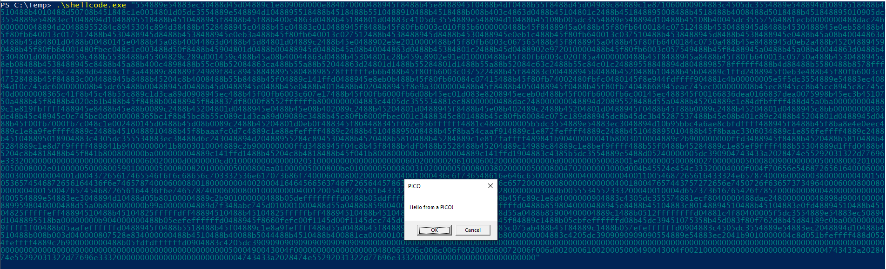

# Hardware Breakpoint PICO

A proof-of-concept hardware breakpoint hooker, implemented as a PICO for Crystal Palace. With this PICO, you can place a hardware breakpoint on an arbitrary address (such as the entrypoint of a WIN32 API) that will invoke your desired payload the next time that address is executed.

The source code is divided up into 3 files.

**breakpoint_hook.c**: Contains the PICO's entrypoint and breakpoint hooking logic. Pass the PICO the address of the function you want to hook as an argument. It will set a hardware breakpoint on that address. When the breakpoint is triggered, a Vectored Exception Handler will redirect execution to your payload function.

**payload.c**: Contains the payload function that is executed when the breakpoint triggers. Because RIP is redirected to your payload function, it will receive all of the same arguments as the function you're hooking. Therefore, it should have the same function signature if you want to seamlessly invoke the original function when you're done.

**runner.c**: A basic PICO runner that compiles to PIC (shellcode). Mostly taken directly from the Tradecraft Garden. Intended to demonstrate the functionality of the PICO: it invokes the PICO to put a breakpoint on `VirtualFree()` just before it gets called. 

To compile and link the PICO and runner, run `make build`. It will work out of the box as long as you have MinGW GCC and a `crystal-palace` directory with all of the CPL executables needed. The resulting shellcode will be written to `out/runner.bin`, and it seamlessly hooks `VirtualFree()` to pop up a dialog box when executed.

Thanks to Raphael Mudge for [Crystal Palace](https://tradecraftgarden.org/crystalpalace.html) and the PICO runner code, Rastamouse for a [blog post](https://rastamouse.me/modular-pic-c2-agents-reprise/) that helped me understand how to merge COFF files with Crystal Palace, and Rad98 for [this implementation of hardware breakpoint hooking](https://github.com/rad9800/hwbp4mw) that I used as a template for this PICO.
