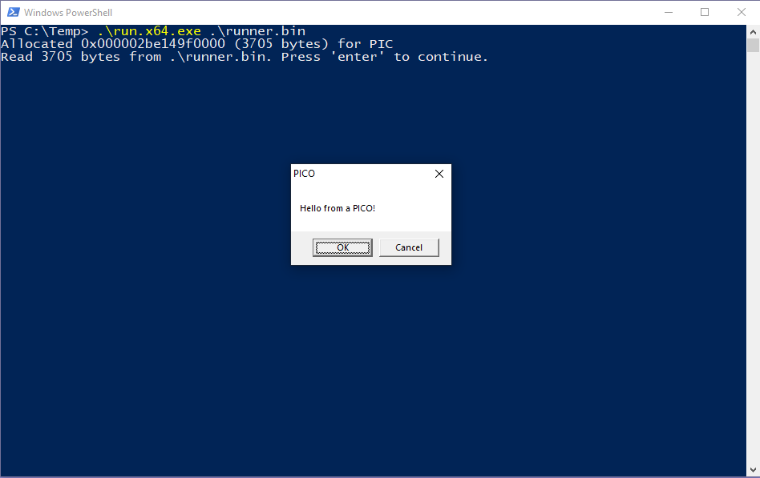

# Hardware Breakpoint PICO

A proof-of-concept hardware breakpoint hooker, implemented as a PICO for Crystal Palace. With this PICO, you can place a hardware breakpoint on an arbitrary address (such as the entrypoint of a WIN32 API) that will invoke your desired payload the next time that address is executed.

The source code is divided up into 3 files.

**breakpoint_hook.c**: Contains the PICO's entrypoint and breakpoint hooking logic. Pass the PICO the address of the function you want to hook as an argument. It will set a hardware breakpoint on that address. When the breakpoint is triggered, a Vectored Exception Handler will redirect execution to your payload function.

**payload.c**: Contains the payload function that is executed when the breakpoint triggers. Because RIP is redirected to your payload function, it will receive all of the same arguments as the function you're hooking. Therefore, it should have the same function signature if you want to seamlessly invoke the original function when you're done.

**runner.c**: A basic PICO runner that compiles to PIC (shellcode). Mostly taken directly from the Tradecraft Garden. Intended to demonstrate the functionality of the PICO: it places a breakpoint on the `VirtualFree()` API just before it gets called.

To build the PICO by itself, run `make pico`. To build the example runner and link it with the PICO, run `make runner`. Both commands will work as long as you have MinGW GCC and a `crystal-palace` directory with all of the CPL executables needed. 

The resulting shellcode will be written to `out/runner.bin`, and it seamlessly hooks `VirtualFree()` to pop up a dialog box when executed:



## Using this PICO

The example PIC that is compiled when you run `make runner` hooks the `VirtualFree()` function by default. If you want to hook a different function, simply pass a different target address when invoking the PICO's entrypoint.

For example, if you wanted to hook `VirtualAlloc()` instead (using Raphael Mudge's PICO runner):

```c
PicoEntryPoint(srcPico, dstCode)(addr_of_virtual_alloc);
```

To hook seamlessly, you should modify `payload.c` to ensure that the `payload()` function matches the signature of the function you're hooking (and invokes it when you're done with your shenanigans). The example payload in `payload.c` matches the function signature of `VirtualFree()`, so you'll need to adjust it when you hook other functions.

## Thanks

Thanks to Raphael Mudge for [Crystal Palace](https://tradecraftgarden.org/crystalpalace.html) and the PICO runner code, Rastamouse for a [blog post](https://rastamouse.me/modular-pic-c2-agents-reprise/) that helped me understand how to merge COFF files with Crystal Palace, and Rad98 for [this implementation of hardware breakpoint hooking](https://github.com/rad9800/hwbp4mw) that I used as a template for this PICO.
