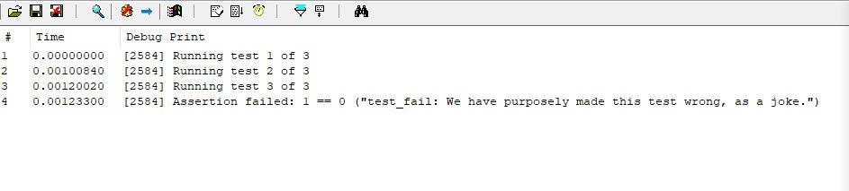

# LibCPLTest

A shared library for Crystal Palace that allows you to unit test your PICOs. You can find example of the library in use [here](https://github.com/ofasgard/execute-assembly-pico/blob/main/src/execute_assembly.c) (CTRL+F for "CPLTESTS").

## Writing Tests

To write a test, add a function to your PICO that takes no arguments and returns void. Use the `ASSERT()` macro provided by `cpltest.h` to make assertions.

Here's a snippet from `execute-assembly-pico` that illustrates a test:

```c
#include "cpltest.h"

#ifdef CPLTESTS
void test_get_clr() {
	HRESULT result;
	AssemblyData assemblyData = { 0 };
	result = get_clr(&assemblyData);
	ASSERT(result == S_OK, "test_get_clr: Could not retrieve the CLR.");
}
#endif
```

As demonstrated above, I recommend using an `#ifdef` to exclude your tests from the "production" version of your PICO.

## Running Tests

As with any Crystal Palace library, you'll need to use the `mergelib` command to merge this library into your PICO. It also relies on LibTCG, so you'll need to merge that in as well. I recommend using a separate linker spec so that your "production" PICO doesn't contain unnecessary LibCPLTest code.

```text
mergelib "lib/libtcg/libtcg.x64.zip"
mergelib "lib/LibCPLTest/libcpltest.x64.zip"
```

LibCPLTest provides a few functions to prepare and invoke your test cases automatically. To run your tests, create a special "tester" version of your PICO that invokes your tests instead of performing its usual functionality. Again, I recommend using an `#ifdef` to toggle this functionality on or off.

```c
#ifdef CPLTESTS

TESTFUNCS tests = initTests();     // Allocate space for test function pointers
addTest(&tests, test_get_clr);     // Add the function pointer for test_get_clr()
runTests(&tests);                  // Run your tests
freeTests(&tests);                 // Free allocated space

#endif
```

The `runTests()` function and the `ASSERT()` macro both use the `dprintf()` function provided by LibTCG to print test output to the debugger stream. I recommend using [DebugView from SysInternals](https://learn.microsoft.com/en-us/sysinternals/downloads/debugview) to view the output of your tests.


